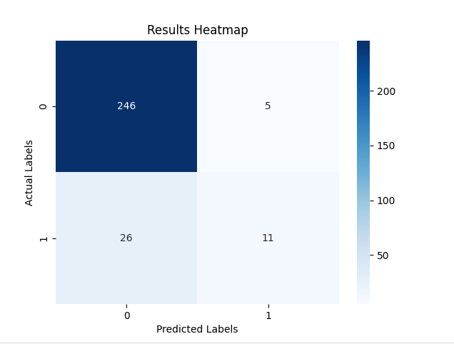
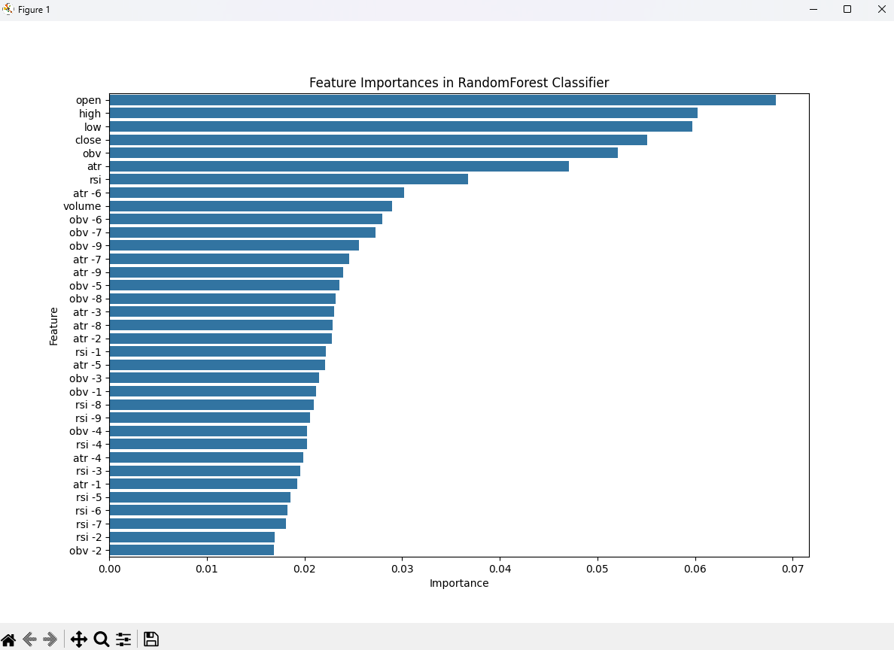

# Feature importance project for 4hr Bitcoin Data

## Overview 

This project is a data science project focused on understanding patterns in candlestick data. The goal of the project is to understand 
which features of the data set used contribute the most to making an accurate prediction whether the price will increase over the next 20 candles.
The data is 4hr BTC/USD downloaded using the Binance API. By combining pandas and TA-lib  I was able to add indicators ATR,RSI and OBV as well as
their lag values to the data.

I am using a Random forest classifier from SKlearn for a model to train and make predictions on the data. The progam sytematically cleans and scales
the data in preperation for training. It makes predictions after training on a test set that is scaled in the same manor as the training data. 
The test predictions are evaluated by 3 metrics: Precision, recall and f1 score. The results are also used to create a confusion matrix and ultimately
into a heat map where the results can be easily interpreted.

The SKlearn 'feature_importances_' function is then used to understand how much each feature contributed to the predictions made by the trained model. 

The results indicate that the close is the most important feature to the model; followed by obv, open, high, low, and ATR. The level of influence drops
off drastically after these features. The model does not believe lagging features as important to consider as the current ones.

Moving forward this project has highlighted to me that it is more promising to investigate more values of indicators from the current candle and to focus less
lagging indicator values.

## Installation

To install and run this project, follow these steps:

1. Clone the repository:
   
   git clone [https://github.com/DariusTrabalza/Feature_importance]